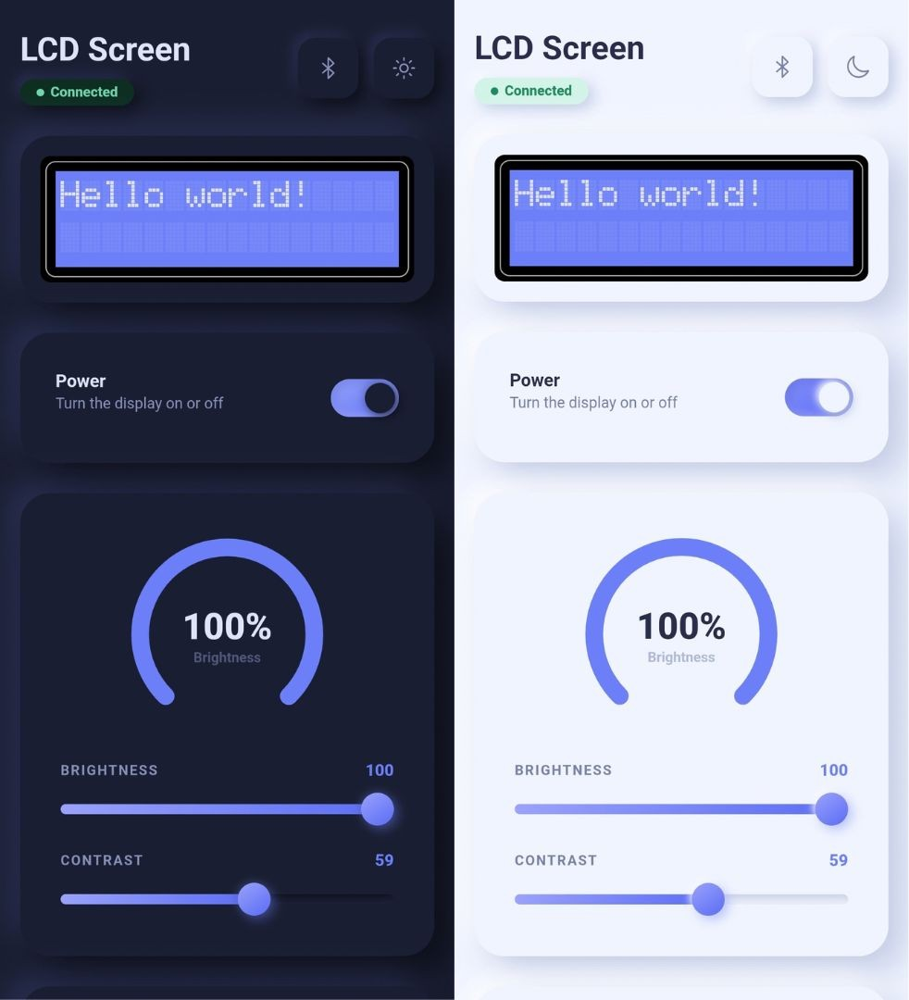
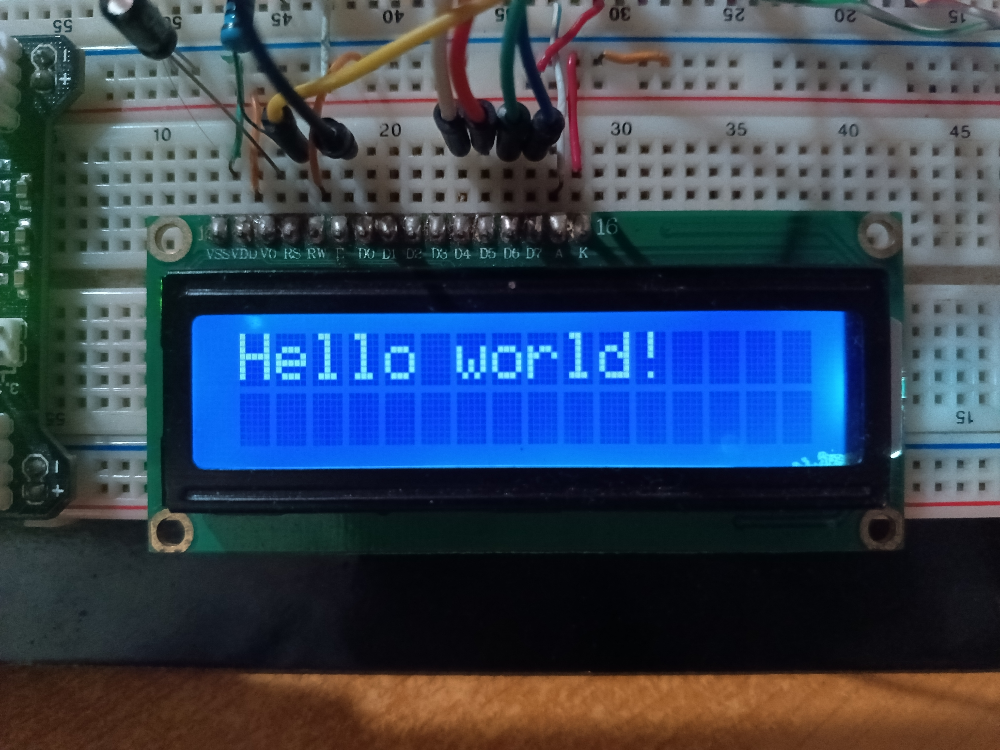
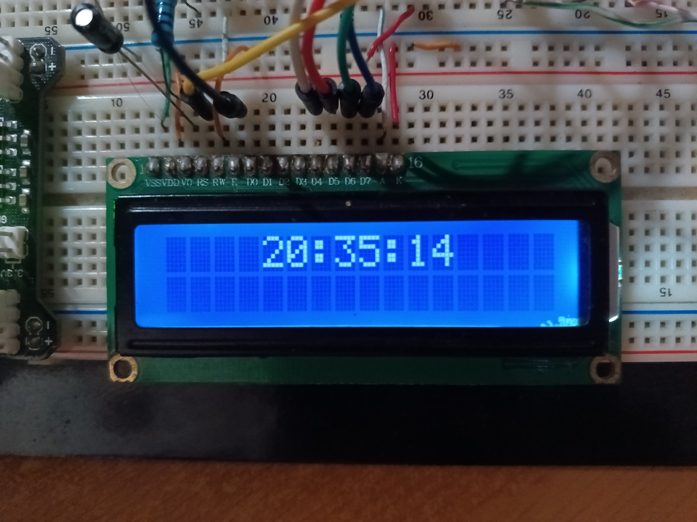
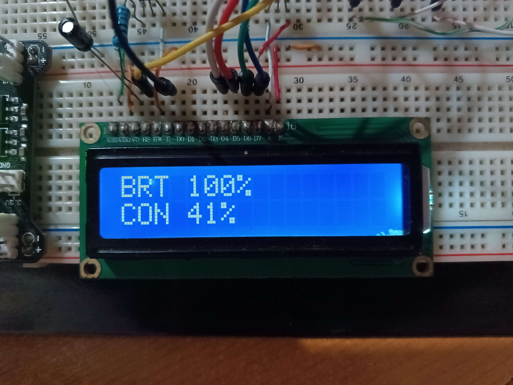

# LCD Screen App

This is a simple project for testing BLE communication on mobile apps using Ionic and React.

It also contains a small implementation of a BLE device using an ESP32 with a LCD 16x2 screen connected to it.



## Folder Structure

- `lcd-screen-app`: This folder contains the ionic app.
- `lcd-esp32`: This folder contains the code for the esp32.

## Setup

This is the setup for the ionic project.

### Prerequisites:
- Ionic
- Java SDK (for building the app to android)
- Android Studio (for building the app to android)

### Dependencies
Install dependencies:
```
npm install
```

### Initializing dev server
```
npm run dev
# or
ionic serve
```

### Building APK
```
npm run build
npx cap sync android
cd android
./gradlew assembleDebug
```

## Device photos:





